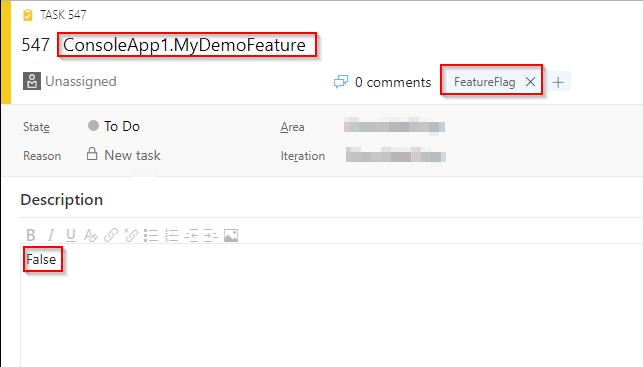

# FeatureSwitcher.VSTSConfiguration
A configuration plugin for FeatureSwitcher that stores FeatureFlags as WorkItems in VSTS.

## Introduction 
This project contains a .NET client library that is available thru NuGet. You can use the library to store FeatureFlag configuration 
for [FeatureSwitcher](https://github.com/mexx/FeatureSwitcher) as VSTS WorkItems.

## Getting Started
1. Install the NuGet package 

```` powershell
Install-Package FeatureSwitcher.VstsConfiguration
````
2.	Add using directives
````csharp
using FeatureSwitcher.VstsConfiguration;
using FeatureSwitcher.Configuration;
````
3.  Now configure FeatureSwitcher to use your VSTS project
````csharp
Features.Are.ConfiguredBy
    .VstsConfig()
    .WithVSTSUrl(new Uri("http://youraccount.visualstudio.com/yourproject"))
    .WithPrivateAccessToken("Your PAT token");
````
Click [here](https://www.visualstudio.com/en-us/docs/setup-admin/team-services/use-personal-access-tokens-to-authenticate) if you need help 
how to create a private access token (PAT)

4.	Run the code that checks your feature. It will automatically create the workitem in VSTS
````csharp
Feature<MyDemoFeature>.Is().Enabled
````

The code will create a WorkItem of the type task by default and add a tag "FeatureFlag". The title of the task 
will comtain the name of your feature (depending on your naming conventions). The value is stored in the description field.  


5.	Enter 'true' in the description field and save the WorkItem. Your feature flag is turned on now.

See the [advanced concepts](#Advanced-concepts) on how to customize the WorItems and support different environments.

## Build and Test
The project is build on a private VSTS instance. The develop branch is automatically deployd to [myget](https://www.myget.org/F/alegri/api/v3/index.json).
The master branch is deployed to myget and after validation to nuget.

|Branch|Status|
|---|---|
|**master**|
|**develop**| |


## Contribute
If you are interested in fixing issues and contributing directly to the code base, 
please create an issue for every topic. Create pull requests only to develop branch.

To run the tests locally youe need a VSTS project. You shoud create a nw project to not mess up your workitems. 
Create a PAT token and store the token in a textfile named 'pat.secret'. Enter the URL to yur project to the app.config of
the test project.

# Advanced concepts
## Environments
The solution supports the concept of environments. The environment is added as a sperate tag to the WorkItem and alows multiple 
flags with the same name (normally it must be unique). Lke this you can use the flag in Dev, Test, QA and Prod with differet values.

````csharp
Features.Are.ConfiguredBy
    .VstsConfig()
    .WithVSTSUrl(new Uri("http://youraccount.visualstudio.com/yourproject")
    .WithPrivateAccessToken("Your PAT token")
    .WithEnvironment("Dev");
````
## Customize WorkItems and Queries
You can customize how the FeatureFlags are stored in VSTS. You can specify your own WorkItemType, the fields and the query that is 
used to retieve them.

For example: you can create a new workitemtype called "FeatureFlag" and add fields to store the name and the value of the flag. 
You can add additional fields like priority and additional tags and expand the query to filter workitems based on these values.

This helps you organize your flags and allows multiple projects, environments, users etc. in one VSTS project.

````csharp
var settings = new VstsSettings
{
    Url = new Uri("http://youraccount.visualstudio.com/yourproject"),
    PrivateAccessToken = "Your PAT token",
    WorkItemType = "FeatureFlag",
    NameField = "FeatureFlag.Name",
    ValueField = "FeatureFlag.Value",
    AdditionalQueryFilter = "and [System.Tags] Contains 'XYZ' and [Microsoft.VSTS.Common.Priority] = 1",
};

settings.AdditionalFields.Add("Microsoft.VSTS.Common.Priority", "1");
settings.AdditionalFields.Add("System.Tags", "XYZ");


Features.Are.ConfiguredBy
    .VstsConfig().WithSettings(settings);
````

